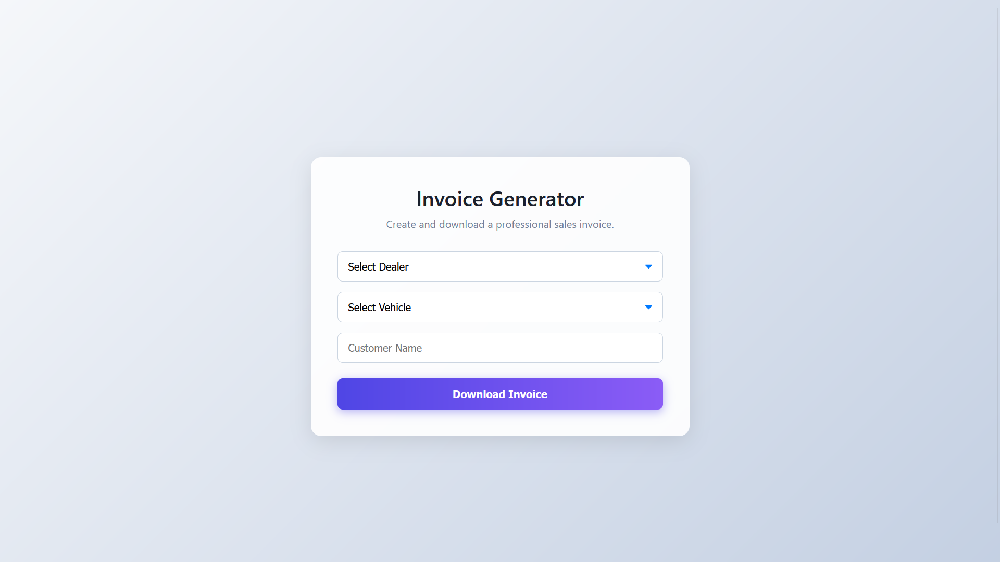
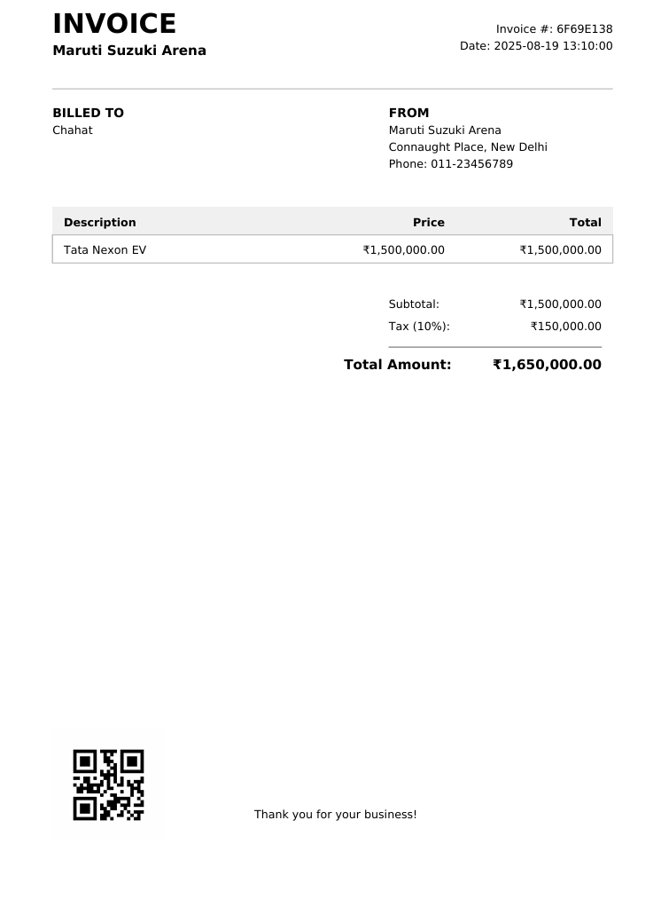

# 📄 Invoice Generation & Deployment System

A full-stack application designed to generate professional vehicle sales invoices as PDFs. The system features a modern React frontend and a robust Spring Boot backend, deployed on an AWS EC2 instance with Nginx for secure and reliable access.

---

### ✨ Live Demo

**[https://100.27.199.132/](https://100.27.199.132/)**

*(Note: A browser security warning will appear due to the use of a self-signed SSL certificate for this demonstration.)*

---

### 📸 Screenshots

| Frontend UI                          | Generated PDF Invoice                                |
|--------------------------------------|------------------------------------------------------|
|  |  |

---

### 🚀 Core Features

-   **Dynamic PDF Generation**: Creates clean, professional PDF invoices on the fly using data from the backend.
-   **QR Code Integration**: Automatically generates and embeds a unique QR code in each invoice for easy tracking.
-   **RESTful API**: A well-defined API built with Spring Boot to handle data and invoice creation.
-   **Modern Frontend**: A responsive and user-friendly interface built with React and Vite.
-   **Secure Deployment**: Hosted on AWS EC2, served via Nginx with SSL, ensuring secure communication.
-   **High Availability**: The backend runs as a `systemd` service, guaranteeing it automatically restarts on failure.

---

### 🛠️ Tech Stack & Architecture

This project utilizes a modern, decoupled architecture to ensure scalability and maintainability.

| Category      | Technology                                    |
| ------------- | --------------------------------------------- |
| **Frontend** | React, Vite, Axios                            |
| **Backend** | Java, Spring Boot, Spring Security, Apache PDFBox |
| **Server** | AWS EC2 (Ubuntu)                              |
| **Web Server**| Nginx (Reverse Proxy with SSL)                |
| **Build Tools**| Maven, npm                                    |

#### System Architecture

1.  A user interacts with the **React Frontend** in their browser.
2.  When an invoice is requested, the frontend sends a request to the `/api` endpoint.
3.  **Nginx** receives the request. It serves the React app for root (`/`) requests and acts as a reverse proxy for `/api` requests, forwarding them securely to the backend.
4.  The **Spring Boot Backend**, running on port 8080, processes the request, generates the PDF, and sends it back as a response.
5.  The entire backend application is managed by **`systemd`** on the Ubuntu server, ensuring it remains active.

---

### ⚙️ Setup & Installation

#### Prerequisites

-   Java 17+
-   Apache Maven
-   Node.js & npm

#### Backend Setup (Local)

1.  Clone the repository.
2.  Navigate to the backend project directory (`invoice-generator`).
3.  Run the application:
    ```bash
    ./mvnw spring-boot:run
    ```
4.  The backend will be running on `http://localhost:8080`.

#### Frontend Setup (Local)

1.  Navigate to the frontend project directory (`frontend`).
2.  Install dependencies:
    ```bash
    npm install
    ```
3.  Start the development server:
    ```bash
    npm run dev
    ```
4.  The frontend will be accessible at `http://localhost:5173`.

---

### ☁️ Server Deployment

The application is deployed on an **AWS EC2 (Ubuntu)** instance following best practices for security and reliability.

1.  **Backend Deployment**:
    -   The Spring Boot application is packaged into an executable JAR.
    -   A `systemd` service (`invoiceapp.service`) is configured to manage the application, ensuring it runs continuously and restarts automatically if it crashes.

2.  **Frontend Deployment**:
    -   The React application is built into static HTML, CSS, and JS files (`npm run build`).
    -   These static files are placed in `/var/www/html` on the server.

3.  **Nginx Configuration**:
    -   Nginx is configured as a reverse proxy.
    -   It serves the static frontend files for requests to the root URL (`/`).
    -   It forwards all requests made to `/api/...` to the Spring Boot backend running on `http://localhost:8080`.
    -   A self-signed SSL certificate is used to enable HTTPS, encrypting all traffic.

---

### Endpoints

-   `GET /api/dealers`: Retrieves a list of all dealers.
-   `GET /api/vehicles`: Retrieves a list of all vehicles.
-   `POST /api/invoices/generate`: Generates and returns a PDF invoice.
    -   **Body**: `{ "dealerId": 1, "vehicleId": 101, "customerName": "Chahat Sharma" }`